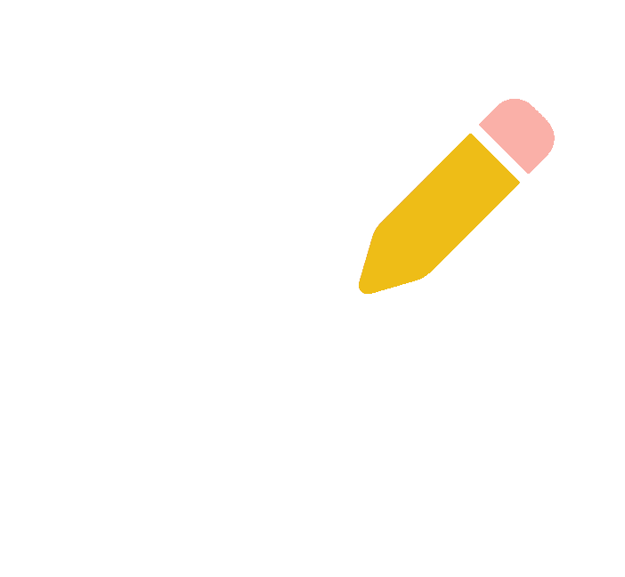

# Noted 

## Getting Started ✅
🌐[Noted]() 

🗒️[Planning Materials](https://trello.com/b/m9fyUYR0/michelle-linares-noted)

## Attributions 📣
**[Reintech.io](https://reintech.io/blog/writing-a-custom-template-context-processor-in-django)** wrote a blog post explaining how to used Custom Template Context Processors in Django, which was used to create different themes on **Noted**.

**Font:** 
**Noted** uses [Short Stack](https://fonts.google.com/specimen/Short+Stack), [Architects Daughter](https://fonts.google.com/specimen/Architects+Daughter), [Short Stack](https://fonts.google.com/specimen/Short+Stack),
[Shadow Into Light Two](https://fonts.google.com/specimen/Shadows+Into+Light+Two). Sourced from [fonts.google.com](https://fonts.google.com/).

**Image Assets:** **Noted** uses Icons sourced from [fontawesome.com](https://fontawesome.com/). 

## Technologies used 🖥

	

- Neon
- Fly.io

## Ice Box 🧊
- [x] Change themese baseds on User's prefernce
- [x] Mobile Responsive
- [ ] Implement Task/To Do Model 
- [ ] Implement Friends List
- [ ] Implement Sharing Notes
- [ ] Implement Different Note templated